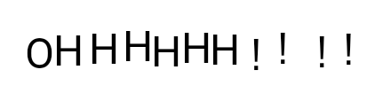
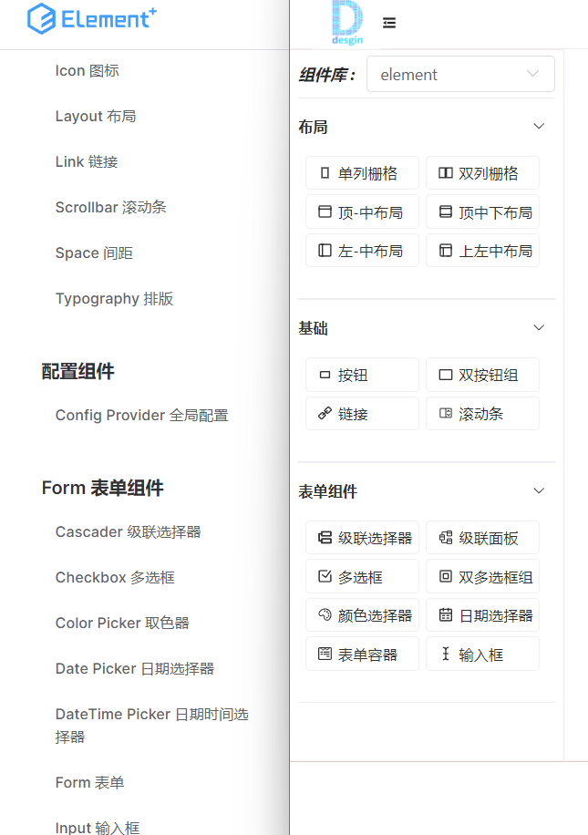
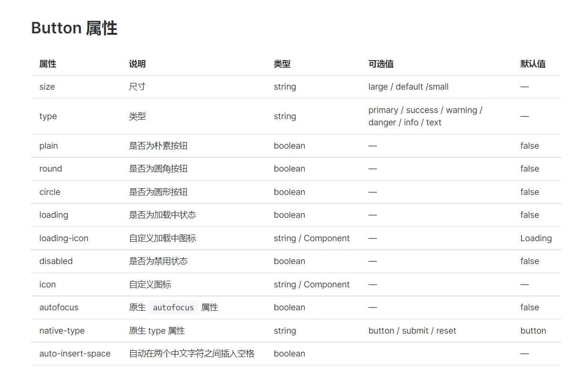
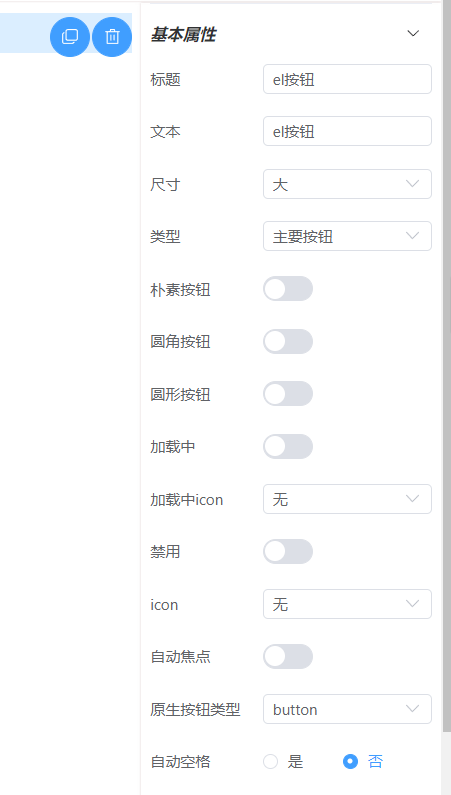
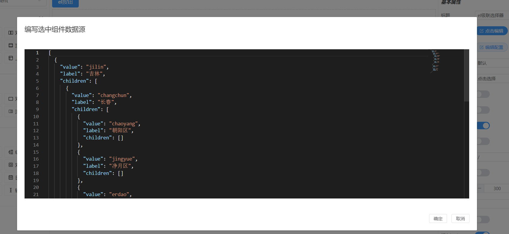
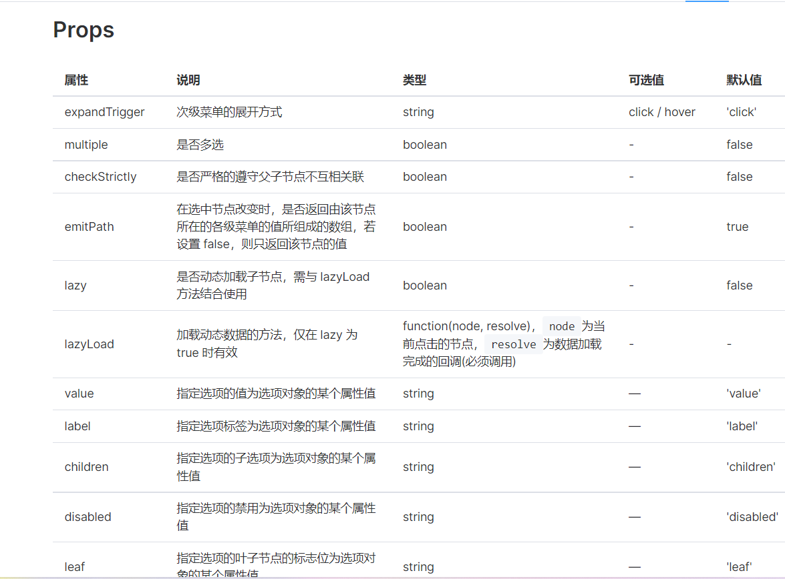
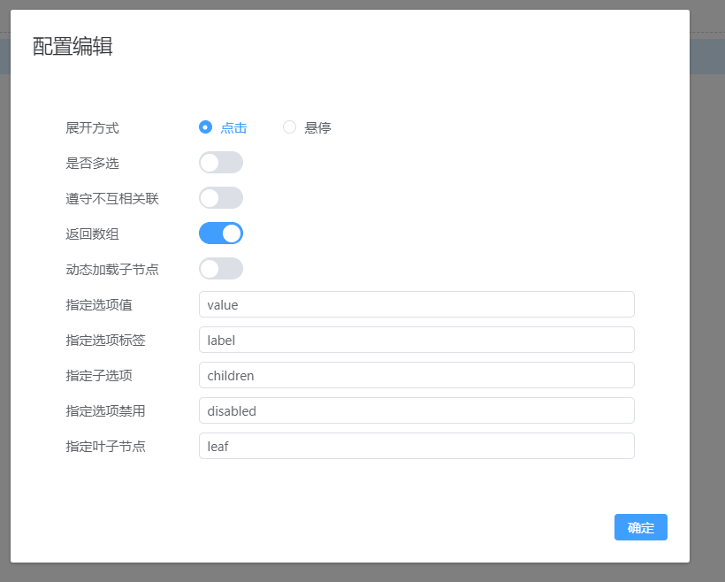
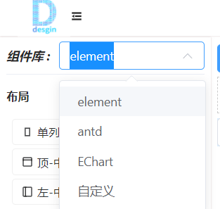
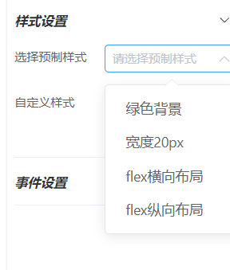
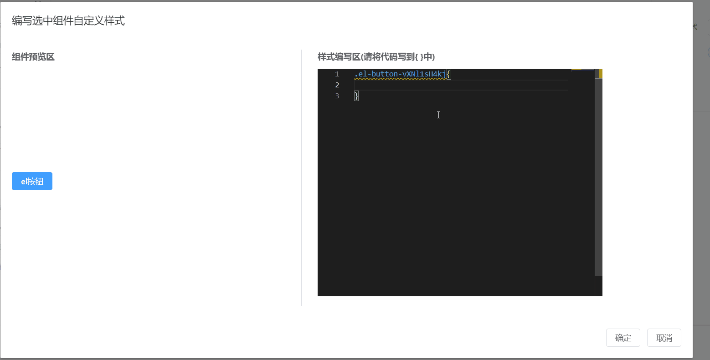

# 背景

2022年x月x日，某前端群。

“我想开发一款页面设计器，目标是功能全到让老板流泪，二次开发简单到令人发指。兄弟萌帮我取个名字”

“dream。我看你在做梦”，一个漂亮软妹随即回复到。

dream？我突然眼前一亮！

是啊！饼确实画的有点大，但是做人如果没有梦想，那和咸鱼又有什么区别呢？

于是便有了它——Dream-design,我的梦想设计器！

Dream的D要大写，代表梦想一定要大

design的d要小写，轻量简单才是我想要的



##  预览地址

[http://dream_design.yaolm.top/](http://dream_design.yaolm.top/)（请使用版本新一点的浏览器🤔）

## 项目介绍

### 与组件库一致的组件列表（大致一样😂）



### 与组件库属性一致的设置面板





### 与编程一致的dom生成

编写如下代码

```vue
<el-row>
    <el-col>
        <el-button>按钮一</el-button>
        <el-button>按钮二</el-button>
    </el-col>
</el-row>
```

运行项目审查元素，观察网页生成的dom元素为

```html
<div class="el-row" data-v-53f231d2="">
	<div class="el-col el-col-24" data-v-53f231d2="">
		<button class="el-button el-button--default" type="button" data-v-53f231d2="">
			<!--v-if-->
				<span class="">按钮一</span>
		</button>
		<button class="el-button el-button--default" type="button" data-v-53f231d2="">
			<!--v-if-->
				<span class="">按钮二</span>
		</button>
	</div>
</div>
```

使用Dreamdesign拖动一个单列栅格和两个按钮

审查元素，观察网页生成的dom元素为

```html
<div class="el-row canvas-component default-slot  not-move" data-v-0edba2b9="" data-v-53f231d2="">
    <div class="el-col el-col-24 canvas-component default-slot  not-move" data-draggable="true" data-v-0edba2b9="">
        <button class="el-button el-button--primary el-button--default canvas-component not-move" type="button" data-draggable="true" data-v-0edba2b9="" style="--el-button-bg-color:#409eff; --el-button-border-color:#409eff; --el-button-hover-bg-color:rgb(102, 177, 255); --el-button-hover-border-color:rgb(102, 177, 255); --el-button-active-bg-color:rgb(58, 142, 230); --el-button-active-border-color:rgb(58, 142, 230);">
            <!--v-if-->
            <span class="">el按钮</span>
        </button>
        <button class="el-button el-button--primary el-button--default canvas-component not-move" type="button" data-draggable="true" data-v-0edba2b9="" style="--el-button-bg-color:#409eff; --el-button-border-color:#409eff; --el-button-hover-bg-color:rgb(102, 177, 255); --el-button-hover-border-color:rgb(102, 177, 255); --el-button-active-bg-color:rgb(58, 142, 230); --el-button-active-border-color:rgb(58, 142, 230);">
            <!--v-if-->
            <span class="">el按钮</span>
        </button>
    </div>
</div>
```


### 设置面板预定义多种格式

除去基本的输入、开关、选择器、单选等，还封装了对象编辑器



> 上图为级联选择器数据源编辑演示

还增加了配置编辑器，用来可视化操作属性为对象时的情况，例如element ui的级联选择器的props属性有如下字段



在Dreamdesign里可视化进行操作



### 与dom层级一致的组件配置

非嵌套组件只需遵守如下格式

```js
    {
    	tag: "el-button",
    	title: "el按钮",
            ...
        childrens: []
    }
```

即可渲染出如下dom

```vue
<el-button></el-button>
```

嵌套组件只需遵守如下格式

```js
    {
    	tag: "el-row",
    	title: "el行容器",
            ...
        childrens: [    
        	{
    			tag: "el-col",
    			title: "el列容器",
            	...
        		childrens: []
    		}]
    }
```

即可渲染出如下dom

```vue
<el-row>
    <el-col></el-col>
</el-row>
```

### 支持多种组件库，支持自定义组件



### 支持全局预定义css调用，支持自定义css

参考public\mock\global_css.json，在此编写了css样式即可在右侧属性面板直接设置于组件上



也可以自定义样式



同时支持全局预定义函数调用，支持自定义函数，效果同上


## 如何进行开发

```powershell
pnpm i

pnpm run dev
```

## 特别说明

其实说白了，就是一个框架，赋予了任意组件拖拽的行为。详细的二次开发文档会等项目开发完毕再编写。
虽然项目还没有开发完，但还是决定先发布出来了，毕竟一个人的力量是有限的，我更希望得到大家的建议